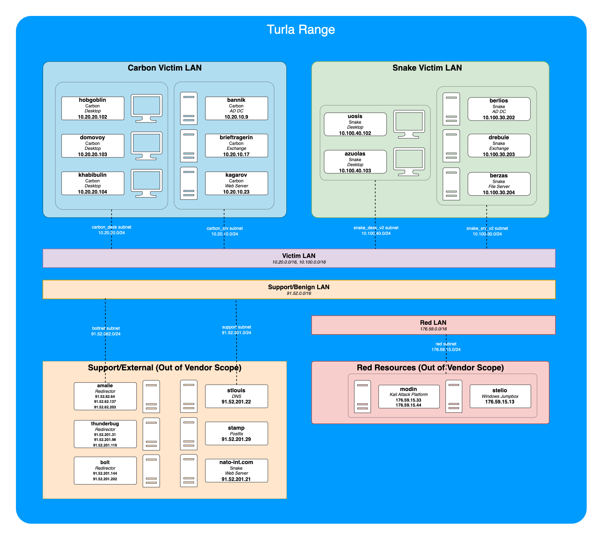

# MITRE Evaluation Turla Range 2023

This project is an easy button for building the [2023 MITRE Evaluation Range](https://github.com/center-for-threat-informed-defense/adversary_emulation_library/tree/master/turla) with Carbon and Snake scenario environments. This was tested using MacOS, so it should work similarly on Linux.

## Phase 1 of the Attack "Carbon"
This scenario follows Turla’s multi-phase intelligence collection campaign by establishing a typo-squatted website of NATO to target entities with a high value of information. During phase one, Turla implants a watering hole for persistence on the victim’s network as a way to compromise more targets of interest. Turla gains initial access through a spearphishing email, a fake software installer is downloaded onto the victim machine, and execution of the EPIC payload takes place. Once persistence and C2 communications are established, a domain controller is discovered, and CARBON-DLL is ingressed into victim network. Further lateral movement brings the attackers to a Linux Apache server where PENGUIN is copied to the server and used to install a watering hole.

## Phase 2 of the Attack "Snake"
In phase two of the attack, the attackers establish a typo-squatted website to target entities with high value information. The victims are prompted to update their (Not)Flash, and in doing so, EPIC is installed on their network. EPIC communicates to the C2 server via proxy web server with HTTPS requests, and SNAKE is then deployed to maintain foothold, elevate privileges and communicates to the C2 via HTTP/SMTP/DNS. Next, the attackers move laterally onto a Microsoft IIS server, install SNAKE, and create an admin account. The attackers then move laterally onto an Exchange workstation, and install SNAKE. Fianlly, they move laterally onto an Exchange Server and install LightNeuron. LIGHTNERON enables email collection and staging for exfiltrating stolen data via benign email PDF/JPG attachments. Turla proceeeds to collect and exfiltrate sensitive communications in an effort to identify new information sources and collect up-to-date information relevant to mission objectives.

## Build Turla Range Setup

### Prerequistes:
* Terraform
* Azure CLI
* Git

SSH Keys will be stored:
* Public = /Users/username/.ssh/id_rsa.pub
* Private = /Users/username/.ssh/id_rsa

```
1. ssh-keygen -b 4096 -t rsa # Generate the Public and Private Keys for SSH
2. git clone https://github.com/scottbrumley/mitre-turla-azure.git
3. cd mitre-turla-azure
4. cp deploy.auto.tfvars.template deploy.auto.tfvars
5. edit deploy.auto.tfvars
6. mv snake.tf snake.tf-disabled # This ignores the Snake environment
7. az login # This should force authentication via the browser and store the keys
8. terraform init  # On first run of terraform
9. terraform apply --auto-approve # This will ask for the public and private ssh keys
10. Once All Windows Hosts are up, use the Bastion to login to each one.
```

## Configure Range
Use The [Configuration Project](https://github.com/scottbrumley/mitre-turla-config/tree/main) on **{prefix-name}-support-dns-srv1** host once the bastion host is provisioned.
```
1. Login to support-dns-srv1
2. git clone https://github.com/scottbrumley/mitre-turla-config.git
3. cd mitre-turla-config
4. ./init.sh # This sets up the ansible environment
5. ansible carbon_lin -i inventory -m ping --ask-pass -u adminuser # This tests Ansible connectivity to Carbon Linux hosts
6. ansible carbon_win -i inventory -m win_ping --ask-pass -u adminuser # This tests Ansible connectivity to Carbon Windows hosts
7. ansible-playbook -i inventory support.yml --ask-pass -u adminuser # Support must be built first since Carbon relies on Carbon
8. ansible-playbook -i inventory carbon.yml --ask-pass -u adminuser
9. ansible-playbook -i inventory red.yml --ask-pass -u adminuser
```

## Destroy Range
```
terraform destroy —auto-approve #  This will ask for the public and private ssh keys
```



